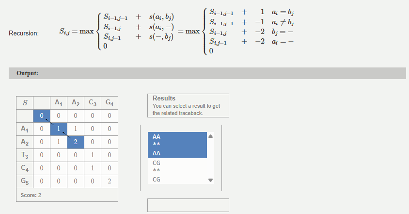

# Sequence Alignment Web Application

A lightweight, full-stack Flask web app that performs **pairwise sequence alignments** between nucleotide or protein sequences using a dynamic programming algorithm. The application allows users to input FASTA sequences, select alignment parameters, and view formatted alignment results directly in the browser.

---

## 🧬 Bioinformatics Background: Alignment Algorithms

This project implements two foundational pairwise sequence alignment algorithms, with explicit scoring logic for nucleotides and proteins. These are core tools in bioinformatics for assessing sequence similarity, evolutionary relationships, and functional conservation.

### 🔹 Needleman–Wunsch Algorithm (Global Alignment)
- **Purpose:** Aligns two sequences end-to-end, optimizing overall similarity.
- **Mechanism:** Uses dynamic programming to fill a scoring matrix based on:
  - **Match score:** Positive reward for identical residues.
  - **Mismatch penalty:** Negative penalty for non-identical residues.
  - **Gap penalty:** Negative penalty for insertions/deletions.
- **Output:** Aligned sequences, global score, percent identity, total gaps.

### 🔹 Smith–Waterman Algorithm (Local Alignment)
- **Purpose:** Detects local regions of high similarity within larger sequences (e.g., conserved domains).
- **Mechanism:** Similar dynamic programming approach, but negative scores are reset to zero to allow partial alignments and the sequence starting position becomes the highest scoring cell in the matrix.
- **Output:** Subsequence alignments with the highest local scores, highlighting functional or conserved motifs.

### 🔹 Substitution Matrices
- **Purpose:** Account for biologically plausible amino acid substitutions. 
- **BLOSUM62:** Optimized for moderately divergent proteins; derived from conserved blocks in aligned sequences.
- **PAM160:** Models evolutionary mutations over smaller distances; more sensitive to closely related sequences.
- **Matrix Use:** Each amino acid pair has a predefined score from the matrix. During alignment:
  - Diagonal moves use the matrix score.
  - Up/Left moves incur the gap penalty.
  - Optimal alignment maximizes cumulative score.

### 🔹 Score Interpretation
- Each cell in the scoring matrix considers:
  1. Diagonal (match/mismatch)
  2. Up (gap in sequence 1)
  3. Left (gap in sequence 2)
  The highest score determines the optimal path, backtracked to reconstruct the aligned sequences.
- **Higher score:** Better alignment; more matches or favorable substitutions.
- **Percent identity:** Fraction of identical positions in aligned region.
- **Gap count:** Reflects insertions/deletions needed to achieve alignment.




---

## 🚀 Features

- **Interactive Alignment Form:** Upload or paste sequences, select target database and scoring matrix dynamically.
- **Backend Integration:** Uses implementations of the Needleman-Wunsch (global) and Smith-Waterman (local) algorithms for performing optimal sequence alignments.
- **Customizable Parameters:** Modify match, mismatch, and gap penalties and choose between `BLOSUM62` and `PAM160` substitution matrices for protein scoring
- **Robust Error Handling:** Gracefully manages invalid inputs, failed alignments, and improper file formats.
- **Session-Based Job Tracking:** Users can view and reload past alignments during a session.
- **Responsive Frontend:** Built with templated HTML and CSS for a seamless user experience.
- **Maintainable Architecture:** Modular Flask structure with separated concerns (`index`, `submit`, `jobs`, `get_job_by_id`).
- **Containerized Deployment:** Fully Dockerized for reproducibility and portability.

---

## 🧠 Tech Stack

| Layer | Technology |
|-------|-------------|
| **Frontend** | HTML5, CSS3, Jinja2 |
| **Backend** | Python 3.13, Flask |
| **Database** | PostgreSQL (Session Tracking) |
| **Testing** | Pytest |
| **Version Control** | Git, GitHub |

---

## 📁 Project Structure

```
seq-aligner/
├── init/
│ └── schema.sql
│
├── src/
│ ├── app.py
│ │
│ ├── core/
│ │ ├── migrate.py
│ │ ├── aligner_base.py
│ │ ├── needleman_wunsch.py
│ │ ├── smith_waterman.py
│ │ └── utils.py
│ │
│ ├── data/
│ │ ├── examples/
│ │ ├── uploaded_files/
│ │ └── saved_jobs.db
│ │
│ ├── resources/
│ │ ├── blosum62.txt
│ │ └── pam160.txt
│ │
│ ├── static/
│ │ ├── images/
│ │ └── styles.css
│ │
│ └── templates/
│ ├── base.html
│ ├── index.html
│ ├── jobs.html
│ └── submit_form.html
│
├── tests/
│ └── test_align.py
│
├── .gitignore
├── docker-compose.yml
├── Dockerfile
├── README.md
└── requirements.txt
```

---

## ⚙️ Installation

1. **Clone the repository**
```bash
git clone https://github.com/<your-username>/sequence-aligner.git
cd sequence-aligner
```
2. **Build and run with docker**
```bash
docker compose up --build -d
```
3. Access the app at http://localhost:5000

---

## 🧩 Example Workflow

1. **User submits input sequences and parameters**
   - Enter or upload query and subject sequences.
2. **Backend validates and processes request**
   - Input is sanitized and passed to the `get_alignment()` function in `/core`.
3. **Alignment performed using the AlignNW/AlignSW classes**
   - Results are formatted and returned as HTML or error messages.
4. **Results displayed**
   - Users can view formatted alignments and revisit past results during session.

---

## 🔍 Error Handling

- `get_alignment()` raises `ValueError` or `KeyError` for invalid or failed alignments.
- `main()` catches and re-raises descriptive exceptions.
- Flask `submit_form` route flashes user-friendly error messages.
- Ensures clean separation of concerns and readable tracebacks for debugging.

---

## 🧪 Testing

Unit tests are implemented using **pytest** to validate:
- Input validation
- Accurate alignment scoring
- Error propagation and flash messaging

Run tests:
```bash
pytest tests\test_align.py
```

---

## 🔧 Future Improvements

- User authentication and session management
- REST API for remote alignment submission
- Enhance alignment visualization (e.g., color-coded residue matches)
- Integration with cloud storage for file handling
- Implement caching layer for repeated queries
- Deployment on AWS / Render / DigitalOcean

---

## 👤 Author

**Michael Tyler**  
Biochemist turned developer building tools that bridge molecular science and software engineering.  
🔗 [LinkedIn](https://linkedin.com/in/mtyler0)  
💻 [GitHub](https://github.com/mtyler0)

---

## 🧾 License

This project is licensed under the **MIT License**.
